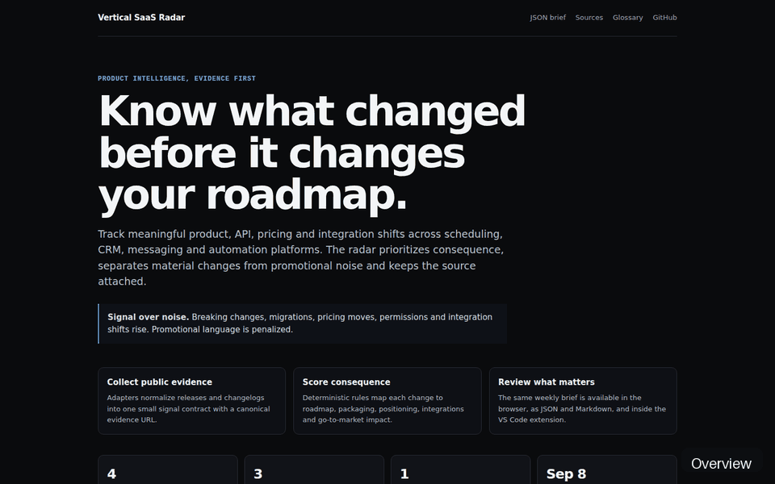
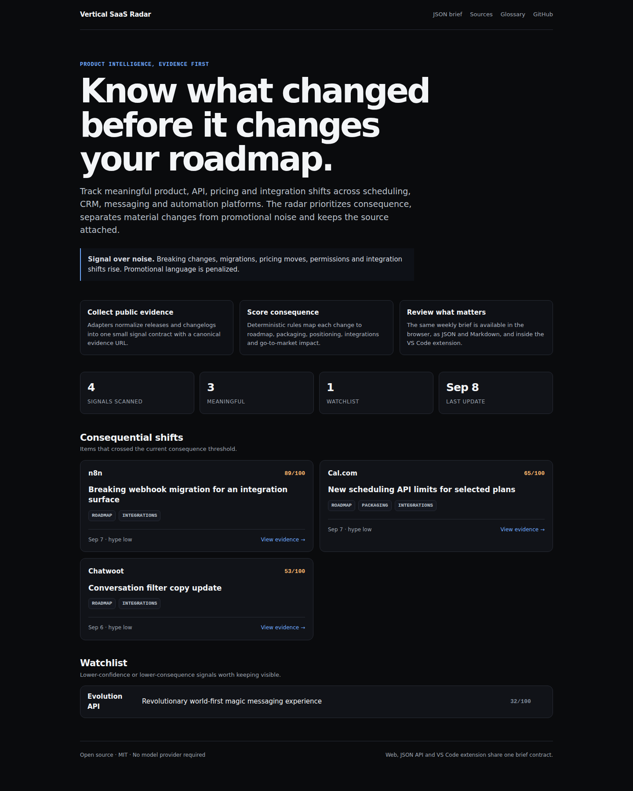

# Vertical SaaS Radar

[](https://github.com/Videirafo/vertical-Saas-radar/actions/workflows/ci.yml)
[](https://github.com/Videirafo/vertical-Saas-radar/actions/workflows/codeql.yml)
[](https://github.com/Videirafo/vertical-Saas-radar/actions/workflows/live-smoke.yml)
[](https://github.com/Videirafo/vertical-Saas-radar/actions/workflows/vscode-extension.yml)
[](./LICENSE)

**Open-source product intelligence for teams building on scheduling, CRM, messaging and automation platforms.**

Product releases move faster than most roadmaps. A pricing change, API migration, new channel capability or integration can change what a team should build, package or position next.

Vertical SaaS Radar turns public release evidence into a short weekly brief that answers five practical questions:

- what changed;
- how consequential it appears;
- which product dimensions it may affect;
- whether the signal looks material or mostly promotional;
- where the source can be verified.

The baseline is deterministic and testable. No model provider, account or API key is required to use the public brief.

## See it in seconds

**[Open the live radar →](https://vertical-saas-radar.onrender.com/)**



<details>
<summary>Full-page screenshot</summary>



</details>

The screenshot and GIF are generated in CI from the real application after the deterministic sample brief is built. They are not design mockups.

Public surfaces:

- [Current brief](https://vertical-saas-radar.onrender.com/api/brief)
- [Source registry](https://vertical-saas-radar.onrender.com/api/sources)
- [OpenAPI](https://vertical-saas-radar.onrender.com/openapi.json)
- [Markdown view](https://vertical-saas-radar.onrender.com/index.md)
- [Glossary](https://vertical-saas-radar.onrender.com/glossary)

## Install the VS Code extension

Download **[vertical-saas-radar-0.1.0.vsix](./dist/vertical-saas-radar-0.1.0.vsix)** and install it with:

```bash
code --install-extension vertical-saas-radar-0.1.0.vsix
```

Or use **Extensions → ··· → Install from VSIX…** in VS Code.

The extension exposes:

- `SaaS Radar: Open Latest Brief`
- `SaaS Radar: Refresh Signals`
- `SaaS Radar: Open Live Demo`

The VSIX is also rebuilt from source in CI. Its manifest is compared with the checked-in install artifact before a release is considered healthy.

## How it works

```text
public release evidence
        ↓
source adapters
        ↓
normalized signal contract
        ↓
deterministic consequence scoring
        ↓
meaningful / watchlist split
        ↓
JSON + Markdown weekly brief
        ↓
web dashboard + VS Code extension
```

### Consequence dimensions

| Dimension | Examples |
| --- | --- |
| Roadmap | agent workflows, automation, scheduling, CRM capabilities |
| Packaging | pricing, plans, quotas, billing and limits |
| Positioning | open-source/self-hosting moves, multi-channel strategy |
| Integrations | APIs, webhooks, OAuth, MCP, WhatsApp, Instagram, queues |
| Go-to-market | marketplaces, partners, templates, agencies, verticals |

Promotional language lowers confidence. Breaking changes, migrations, pricing moves, permission changes and integration changes raise consequence weight.

The radar is a prioritization aid, not a claim of market truth. Every item keeps its evidence URL so the reader can verify the source directly.

## Initial source registry

The first adapter monitors public GitHub releases from:

- n8n — workflow automation and integrations;
- Cal.com — scheduling infrastructure;
- Twenty — CRM;
- Chatwoot — customer support and messaging;
- Evolution API — messaging integration surface;
- changedetection.io — change-monitoring patterns.

These projects are monitored as public evidence sources. Their implementation and branding are not incorporated into this repository.

## Weekly brief

The scheduled workflow runs every Monday at **18:00 America/Sao_Paulo (21:00 UTC)** and refreshes:

- `data/signals.json` — normalized source signals;
- `data/latest.json` — machine-readable brief;
- `data/latest.md` — human-readable brief.

Local collection:

```bash
npm run collect
npm run brief
```

`GITHUB_TOKEN` is optional for local runs and is provided automatically inside GitHub Actions.

## Run locally

Requires Node.js 20 or newer.

```bash
git clone https://github.com/Videirafo/vertical-Saas-radar.git
cd vertical-Saas-radar
npm test
npm run brief:sample
npm run dev
```

Then open:

- `http://localhost:3000/`
- `http://localhost:3000/api/brief`
- `http://localhost:3000/api/sources`
- `http://localhost:3000/health`

To develop the extension, open `apps/vscode` in VS Code and press `F5` to launch an Extension Development Host.

## Repository layout

```text
apps/
  web/          browser dashboard + HTTP API
  vscode/       VS Code extension
packages/
  core/         deterministic scoring and brief contract
scripts/        collectors and brief builder
data/           source registry, samples and generated brief
docs/           architecture, source policy and release verification
tests/          classifier and contract tests
dist/           installable VS Code extension artifact
```

Key documents:

- [Architecture](./docs/ARCHITECTURE.md)
- [Source policy](./docs/SOURCE_POLICY.md)
- [Release verification](./docs/RELEASE.md)
- [Contributing](./CONTRIBUTING.md)
- [Security](./SECURITY.md)

## Quality gates

A public release is considered healthy only when all of these are green:

1. CI tests and local HTTP smoke;
2. CodeQL security analysis;
3. VS Code extension packaging from source;
4. verified browser screenshot/GIF generation;
5. public live-demo smoke;
6. external discovery/accessibility scan;
7. exact merged `main` SHA deployed on Render.

See [docs/RELEASE.md](./docs/RELEASE.md) for verification and rollback rules.

## Contributing

The easiest useful contribution is a new source adapter or a scoring test based on a real release.

Read [CONTRIBUTING.md](./CONTRIBUTING.md) before opening a pull request. Source additions must point to public evidence and must not require private scraping or copied proprietary content.

## Roadmap

- [x] deterministic consequence scoring;
- [x] hype penalty and evidence links;
- [x] browser dashboard and JSON API;
- [x] VS Code extension source and installable VSIX;
- [x] Monday scheduled brief;
- [x] GitHub release collector;
- [x] public Render deployment;
- [x] OpenAPI and agent-readable discovery surfaces;
- [x] external live-smoke and release verification gates;
- [ ] official changelog adapters beyond GitHub releases;
- [ ] source freshness and health reporting;
- [ ] contributor-maintained source catalog;
- [ ] optional summarizer adapter behind the deterministic evidence layer.

## License

MIT. See [LICENSE](./LICENSE).
